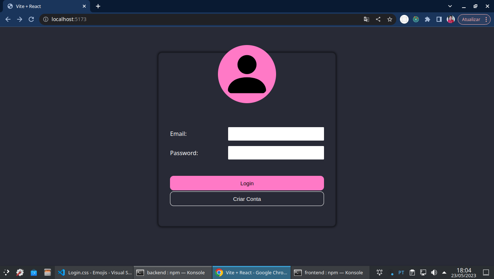
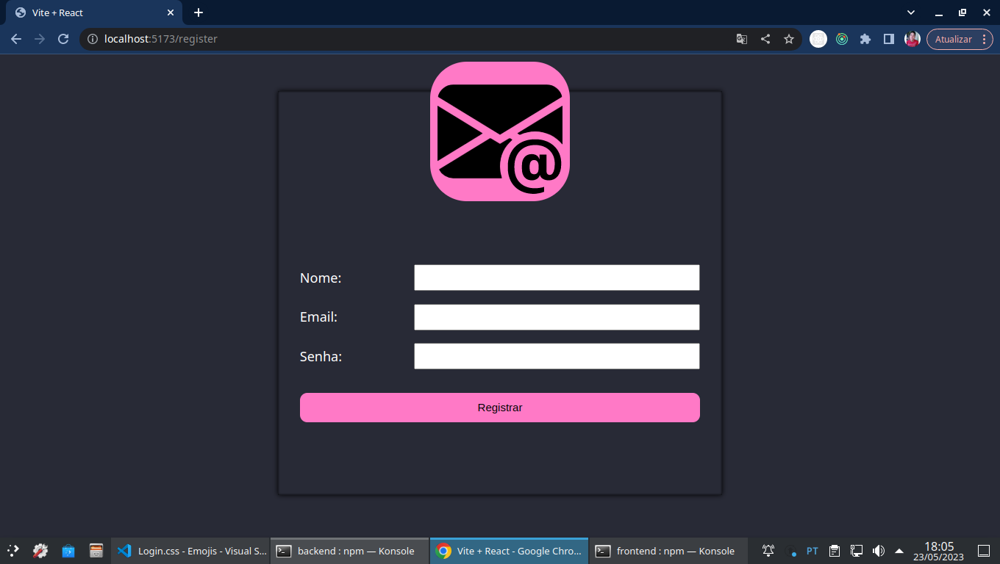
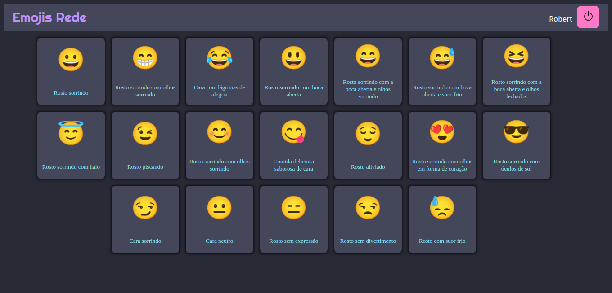
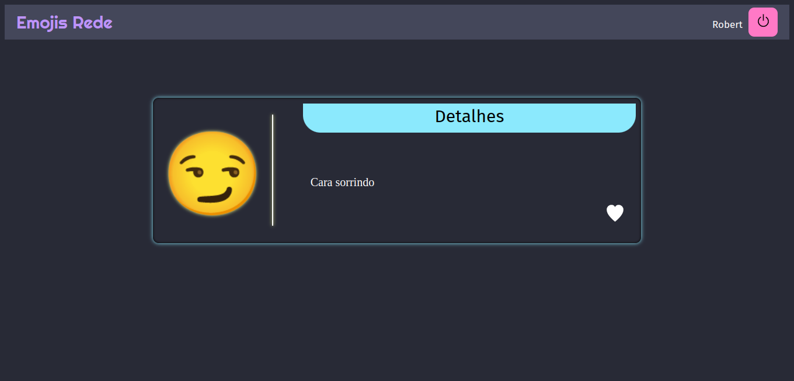

# Emojis

## Resumo
Um álbum de Emojis, exclusivos para os usuarios da ***"Emojis Rede"***. Esta aplicação permite que cada usuario possa favoritar um emoji, mas para isso é necessario que uma conta seja registrada.

 

## Sumário
[01 - Explicação](#explicação)

[02 - Tecnologias e ferramentas](#tecnologias-e-ferramentas)

[03 - Status](#status)

 

## Explicação

  
  
  
  

 

O projeto **Emojis**. Foi criado com o objetivo de por em pratica os conhecimentos adquiridos em __FrontEnd__, __BackEnd__ e __Databases__.

 

Esta aplicação necessita que o usuario crie uma uma conta, e ao inserir o email e senha, o mesmo sera direcioando para uma pagina onde tera acesso a uma lista de `emojis`. E toda vez que o usuario clicar em um deles, entao podera ver outras informações e até mesmo poder marcar como favorito.

 

Abaixo, veja algumas informações:

  
<strong>FrontEnd</strong>

   
  
As paginas são feitas da seguinte forma:

  <ul>
    <li>
      <code>/emojis</code>: 
      É a pagina de login, onde o usuario, precisará, inserir seu email e senha para ter acesso a aplicação.
    </li>
    <li>
      <code>/register</code>: 
      É a pagina de registro de conta dos usuarios.
    </li>
    <li>
      <code>/emojis</code>: 
      É a pagina que mostra uma lista de todos os emojis disponiveis no banco de dados.
    </li>
    <li>
      <code>/emojis/:id</code>: 
      É a pagina que mostra informações de um emoji que foi selecionado pelo usuario.
    </li>
  </ul>
  
OBS: Estão na mesma ordem das imagens acima.

  
<strong>BackEnd</strong>

   
  
As rotas são feitas da seguinte forma:

  <ul>
    <li>
      GET
      <ul>
        <li>
          <code>/emojis</code>:
          É utilizada para obter uma lista completa de todos os emojis disponiveis no <strong>BD</strong>.
        </li>
        <li>
          <code>/emojis/:id</code>:
          É utilizada para obter apenas um emoji que será localizado atraves de seu <code>id</code>.
        </li>
        <li>
          <code>/favorites/user/:userId</code>: 
          É utilizada para identificar todos os emojis favoritados pelo usuario passado por <code>id</code>.
        </li>
        <li>
          <code>/favorites/emoji/:emojiId</code>: 
          É utilizada para identificar os usuario que favoritaram o emoji passado por <code>id</code>.
        </li>
        <li>
          <code>/favorites/:id</code>: 
          É utilizada apenas para obter um valor, da tabela intermediaria, pelo seu <code>id</code>.
        </li>
      </ul>
    </li>
    <li>
      POST
      <ul>
        <li>
          <code>/users/login</code>: 
          É utilizada para fazer a requisição e validação do email do usuario.
        </li>
        <li>
          <code>/users/register</code>:
          É utilizada para fazer o registro de uma nova conta de usuario.
        </li>
      </ul>
    </li>
  </ul>

  
<strong>Banco de Dados</strong>

   
  
Foi usado o tipo <em>relacional</em>, que usa as seguintes tabelas:

  <ul>
    <li>
      <code>users</code>:
      Armazena todos os usuarios da aplicação.
    </li>
    <li>
      <code>emojis</code>: 
      Armazena todos os emojis da aplicação.
    </li>
    <li>
      <code>users_emojis</code>:
      Tabela intermediaria, que faz o relacionamentos dos usuarios que favoritaram um emoji.
    </li>
  </ul>

 

## Tecnologias e ferramentas
<table align="center" width="100%">
  <thead>
    <tr>
      <th>FrontEnd</th>
      <th>BackEnd</th>
      <th>Outros</th>
    </tr>
  <thead>
  <tbody>
    <tr>
      <td width="200">
        React 
        Redux 
        Axios 
        React Router Dom
      </td>
      <td width="200">
        Node JS 
        Express 
        TypeScript 
        Mocha 
        Sinon 
        JWT 
        Jest
      </td>
      <td rowspan="2">
        Sequelize 
        Docker Compose
      </td>
    </tr>
  </tbody>
</table>

 

## Status
🚨 Está aplicação ainda esta em `desenvolvimento`, e por isso não possui as instruções de como clonar e exercultar.
