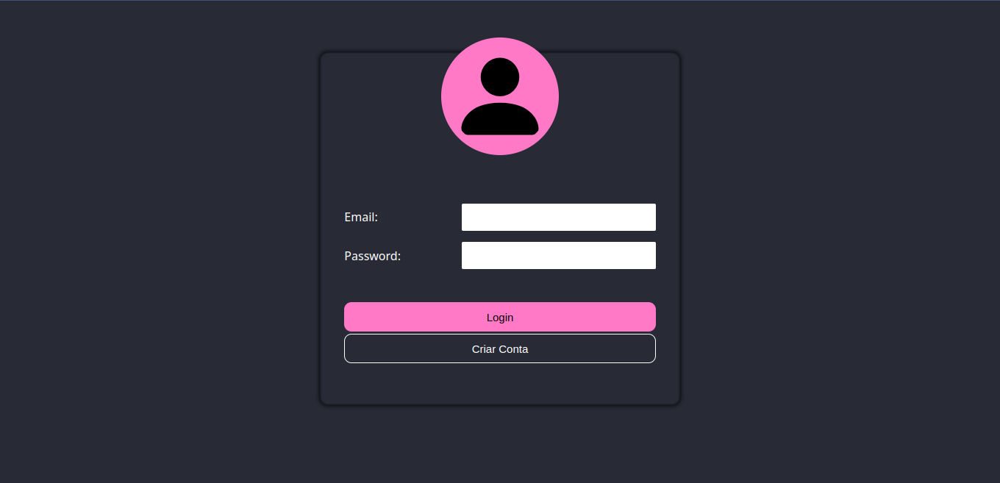
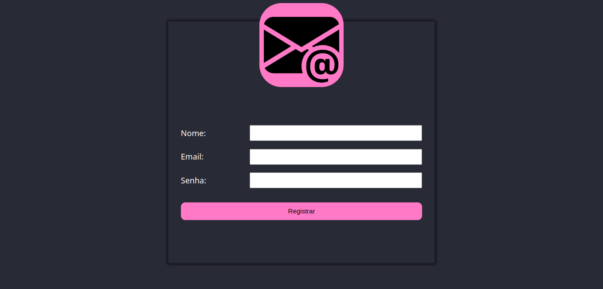

# Emojis

## Resumo
Um álbum de Emojis, exclusivos para os usuarios da ***"Emojis Rede"***. Esta aplicação permite que cada usuario possa favoritar um emoji, mas para isso é necessario que uma conta seja registrada.

 

## Explicação

  
  
  
  

 

O projeto **Emojis**. Foi criado com o objetivo de por em pratica os conhecimentos adquiridos em __FrontEnd__, __BackEnd__ e __Databases__.

Esta aplicação necessita que o usuario crie uma uma conta, e ao inserir o email e senha, o mesmo sera direcioando para uma pagina onde tera acesso a uma lista de `emojis`. E toda vez que o usuario clicar em um deles, entao podera ver outras informações e até mesmo poder marcar como favorito.

Para o _FrontEnd_, as paginas são feitas da seguinte forma:
- `/`: É a pagina de login, onde o usuario, precisará, inserir seu email e senha para ter acesso a aplicação.
- `/register`: É a pagina de registro de conta dos usuarios.
- `/emojis`: É a pagina que mostra uma lista de todos os emojis disponiveis no banco de dados.
- `/emojis/:id`: É a pagina que mostra informações de um emoji que foi selecionado pelo usuario.

**OBS**: Estão na mesma ordem das imagens acima.

 

Para o _BackEnd_, as rotas são feitas da seguinte forma:
- GET
  - `/emojis`: É utilizada para obter uma lista completa de todos os emojis disponiveis no **BD**.
  - `/emojis/:id`: É utilizada para obter apenas um emoji que será localizado atraves de seu `id`.
  - `/favorites/user/:userId`: É utilizada para identificar todos os emojis favoritados pelo usuario passado por `id`.
  - `/favorites/emoji/:emojiId`: É utilizada para identificar os usuario que favoritaram o emoji passado por `id`.
  - `/favorites/:id`: É utilizada apenas para obter um valor, da tabela intermediaria, pelo seu `id`.

- POST
  - `/users/login`: É utilizada para fazer a requisição e validação do email do usuario.
  - `/users/register`: É utilizada para fazer o registro de uma nova conta de usuario.
